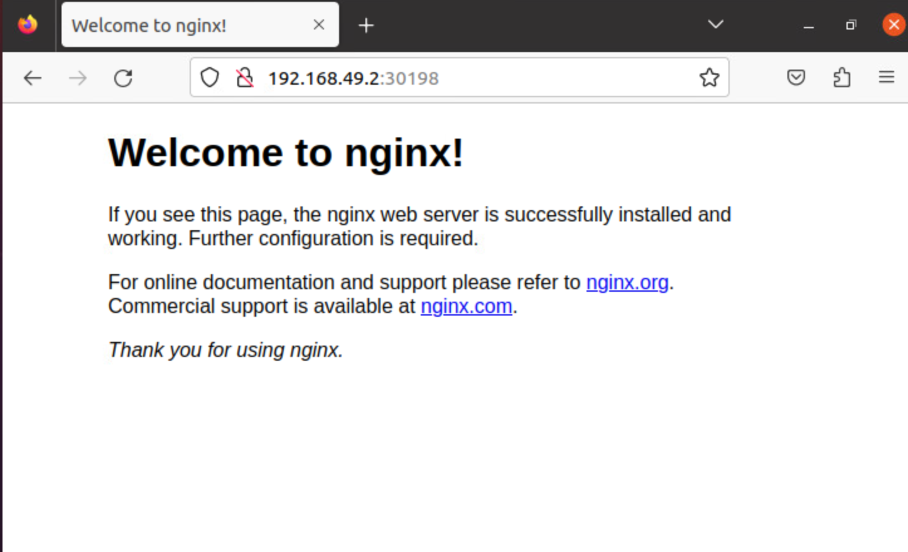

# 前提
今回の検証を始めたモチベーションは、単純にk8sを触ってみたいなというのが1番でした。<br>
あと、お家でk8sクラスタ組んでサービスデプロイしたいなー（docker単体だと辛いことが増えてきた）という2つのモチベーションでした。<br>
# 作業環境
- 構築対象サーバー
    - ubuntu22.04
    - vCPU 2
    - RAM 8GB
    - ESXi上に構築（VMware playerでもVirtualBoxでもOK）
- 構築サーバーへのアクセス
    - 同じセグメントにあるMacOSからsshで接続
# 構築手順
## 必要パッケージのinstall
### command
```bash
sudo apt update && sudo apt upgrade -y
sudo apt install -y curl docker.io lynx
```

## minikubeのinstall
### command
```bash
curl -Lo minikube https://storage.googleapis.com/minikube/releases/latest/minikube-linux-amd64
chmod +x minikube
sudo mv minikube /usr/local/bin/
```
[参考サイト](https://minikube.sigs.k8s.io/docs/start/)

## kubectlのinstall
### command
```bash
curl -LO "https://dl.k8s.io/release/$(curl -LS https://dl.k8s.io/release/stable.
chmod +x ./kubectl
sudo mv ./kubectl /usr/local/bin/kubectl
kubectl version --client
```
[参考サイト](https://kubernetes.io/ja/docs/tasks/tools/install-kubectl/)

### log
```bash
$ curl -LO "https://dl.k8s.io/release/$(curl -LS https://dl.k8s.io/release/stable.txt)/bin/linux/amd64/kubectl"
  % Total    % Received % Xferd  Average Speed   Time    Time     Time  Current
                                 Dload  Upload   Total   Spent    Left  Speed
100   138  100   138    0     0    450      0 --:--:-- --:--:-- --:--:--   450
100     7  100     7    0     0     14      0 --:--:-- --:--:-- --:--:--    14
  % Total    % Received % Xferd  Average Speed   Time    Time     Time  Current
                                 Dload  Upload   Total   Spent    Left  Speed
100   138  100   138    0     0    575      0 --:--:-- --:--:-- --:--:--   575
100 47.5M  100 47.5M    0     0  43.7M      0  0:00:01  0:00:01 --:--:-- 57.3M
$ chmod +x ./kubectl
$ sudo mv ./kubectl /usr/local/bin/kubectl
$ kubectl version --client
Client Version: v1.28.1
Kustomize Version: v5.0.4-0.20230601165947-6ce0bf390ce3
```

## dockerをroot権限なしで実行できるように権限付与

```bash
sudo usermod -aG docker $USER
```
一旦ログアウトして適用させる

## minikubeの起動
### command
```bash
minikube start --driver=docker
```
デフォルトでCPUが2必要になるので注意


### log
```bash
$ minikube start --driver=docker
😄  minikube v1.31.2 on Ubuntu 20.04
✨  Using the docker driver based on user configuration
📌  Using Docker driver with root privileges
👍  Starting control plane node minikube in cluster minikube
🚜  Pulling base image ...
💾  Downloading Kubernetes v1.27.4 preload ...
    > preloaded-images-k8s-v18-v1...:  393.21 MiB / 393.21 MiB  100.00% 24.90 M
    > gcr.io/k8s-minikube/kicbase...:  447.62 MiB / 447.62 MiB  100.00% 22.05 M
🔥  Creating docker container (CPUs=2, Memory=2200MB) ...
🐳  Preparing Kubernetes v1.27.4 on Docker 24.0.4 ...
    ▪ Generating certificates and keys ...
    ▪ Booting up control plane ...
    ▪ Configuring RBAC rules ...
🔗  Configuring bridge CNI (Container Networking Interface) ...
🔎  Verifying Kubernetes components...
    ▪ Using image gcr.io/k8s-minikube/storage-provisioner:v5
🌟  Enabled addons: default-storageclass, storage-provisioner
🏄  Done! kubectl is now configured to use "minikube" cluster and "default" namespace by default
```
### status
```bash
$ minikube status
minikube
type: Control Plane
host: Running
kubelet: Running
apiserver: Running
kubeconfig: Configured
```

## service起動(nginx)
### 起動させるmanifestファイル
`nginx-deployment.yaml`
```yaml
apiVersion: apps/v1
kind: Deployment
metadata:
  name: nginx-deployment
spec:
  replicas: 2
  selector:
    matchLabels:
      app: nginx
  template:
    metadata:
      labels:
        app: nginx
    spec:
      containers:
      - name: nginx
        image: nginx:1.19.3
        ports:
        - containerPort: 80

---
apiVersion: v1
kind: Service
metadata:
  name: nginx-service
spec:
  selector:
    app: nginx
  ports:
    - protocol: TCP
      port: 80
      targetPort: 80
  type: NodePort

```
### 実行ログ
```bash
$ kubectl apply -f nginx-deployment.yaml
deployment.apps/nginx-deployment created
service/nginx-service created
```

## 起動後確認(nginx)
### log 
```bash
$ kubectl get deployments
NAME               READY   UP-TO-DATE   AVAILABLE   AGE
nginx-deployment   2/2     2            2           4m5s
$ kubectl get pods
NAME                                READY   STATUS    RESTARTS   AGE
nginx-deployment-84446cbc78-czf2j   1/1     Running   0          4m20s
nginx-deployment-84446cbc78-mkmsq   1/1     Running   0          4m20s
$ kubectl get services
NAME            TYPE        CLUSTER-IP      EXTERNAL-IP   PORT(S)        AGE
kubernetes      ClusterIP   10.96.0.1       <none>        443/TCP        7m38s
nginx-service   NodePort    10.111.103.54   <none>        80:30198/TCP   4m39s
```
### serviceへのアクセス確認
```bash
minikube service nginx-service
|-----------|---------------|-------------|---------------------------|
| NAMESPACE |     NAME      | TARGET PORT |            URL            |
|-----------|---------------|-------------|---------------------------|
| default   | nginx-service |          80 | http://192.168.49.2:30198 |
|-----------|---------------|-------------|---------------------------|
🎉  Opening service default/nginx-service in default browser...
Error: no DISPLAY environment variable specified
```
起動しているubuntuのdesktopからアクセスすると


docker コマンドでも確認する。
```bash
$ docker ps
CONTAINER ID   IMAGE                                 COMMAND                  CREATED          STATUS          PORTS                                                                                                                                  NAMES
d5d048a64c7f   gcr.io/k8s-minikube/kicbase:v0.0.40   "/usr/local/bin/entr…"   13 minutes ago   Up 13 minutes   127.0.0.1:32772->22/tcp, 127.0.0.1:32771->2376/tcp, 127.0.0.1:32770->5000/tcp, 127.0.0.1:32769->8443/tcp, 127.0.0.1:32768->32443/tcp   minikube
```
1. **CONTAINER ID**: Dockerコンテナの一意のID。このIDを使用して、コンテナに関連する操作を行うことができます。

2. **IMAGE**: コンテナが使用しているDockerイメージの名前とタグ。ここでは、Minikubeが使用している特定のイメージ（`gcr.io/k8s-minikube/kicbase:v0.0.40`）が示されています。

3. **COMMAND**: コンテナが起動時に実行するコマンド。このコンテナでは`/usr/local/bin/entrypoint`のようなスクリプトが実行されているようです。

4. **CREATED**: コンテナが作成されてからの経過時間。このコンテナは約13分前に作成されたことを示しています。

5. **STATUS**: コンテナの現在のステータス。`Up 13 minutes`は、このコンテナが13分前に起動し、現在も稼働中であることを示しています。

6. **PORTS**: ホストマシンとコンテナ間でのポートのマッピング情報。この情報により、ホストマシンの特定のポートからコンテナの特定のポートにアクセスすることができます。例えば、ホストの`32772`ポートは、コンテナの`22`ポート（SSH）にマッピングされています。

7. **NAMES**: コンテナの名前。この名前を使用して、コンテナを識別したり操作したりすることができます。この場合、コンテナの名前は`minikube`です。

この`docker ps`の出力は、Minikubeがローカルマシン上でDockerを使用してKubernetesクラスタを起動していることを示しています。Minikubeは、Dockerの`kicbase`イメージを基にして、シングルノードのKubernetesクラスタを作成します。

## service起動(centos)
### 起動させるmanifestファイル
`centos-deployment.yaml`
```yaml
apiVersion: apps/v1
kind: Deployment
metadata:
  name: centos-deployment
spec:
  replicas: 1
  selector:
    matchLabels:
      app: centos
  template:
    metadata:
      labels:
        app: centos
    spec:
      containers:
      - name: centos
        image: centos:latest
        command:
        - "/bin/bash"
        - "-c"
        - "while true; do sleep 3600; done"
```
### 実行ログ
```bash
$ kubectl apply -f centos-deployment.yaml
deployment.apps/centos-deployment created
```
## 起動後確認(centos)
```bash
$ kubectl get pods -l app=centos
NAME                                 READY   STATUS    RESTARTS   AGE
centos-deployment-7b4bb8bc64-ppzls   1/1     Running   0          13s
$ kubectl exec -it centos-deployment-7b4bb8bc64-ppzls -- /bin/bash
[root@centos-deployment-7b4bb8bc64-ppzls /]# ls
bin  dev  etc  home  lib  lib64  lost+found  media  mnt  opt  proc  root  run  sbin  srv  sys  tmp  usr  var
[root@centos-deployment-7b4bb8bc64-ppzls /]# cat /etc/os-release
NAME="CentOS Linux"
VERSION="8"
ID="centos"
ID_LIKE="rhel fedora"
VERSION_ID="8"
PLATFORM_ID="platform:el8"
PRETTY_NAME="CentOS Linux 8"
ANSI_COLOR="0;31"
CPE_NAME="cpe:/o:centos:centos:8"
HOME_URL="https://centos.org/"
BUG_REPORT_URL="https://bugs.centos.org/"
CENTOS_MANTISBT_PROJECT="CentOS-8"
CENTOS_MANTISBT_PROJECT_VERSION="8"
[root@centos-deployment-7b4bb8bc64-ppzls /]# ip a
1: lo: <LOOPBACK,UP,LOWER_UP> mtu 65536 qdisc noqueue state UNKNOWN group default qlen 1000
    link/loopback 00:00:00:00:00:00 brd 00:00:00:00:00:00
    inet 127.0.0.1/8 scope host lo
       valid_lft forever preferred_lft forever
2: eth0@if7: <BROADCAST,MULTICAST,UP,LOWER_UP> mtu 1500 qdisc noqueue state UP group default
    link/ether 2e:69:b4:65:b8:98 brd ff:ff:ff:ff:ff:ff link-netnsid 0
    inet 10.244.0.5/16 brd 10.244.255.255 scope global eth0
       valid_lft forever preferred_lft forever
```

# 感想
実際触ってみたら結構サクッと構築はできました。しかし、マニフェストファイルは自分で書いていないし、ネットワークがどうなっているかもわからないんでこれから触って理解して行こうと思います。